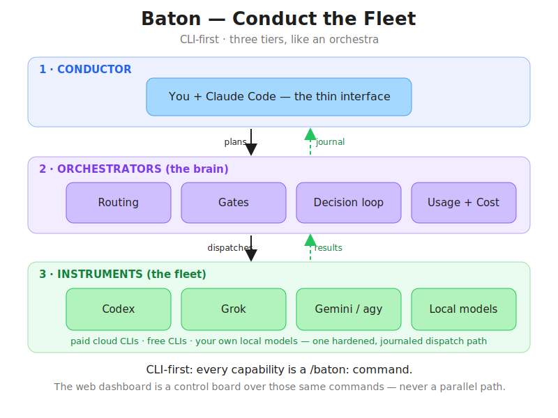
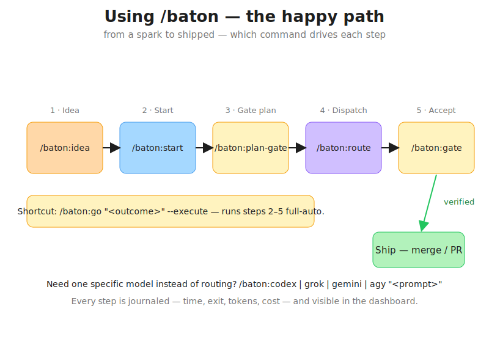
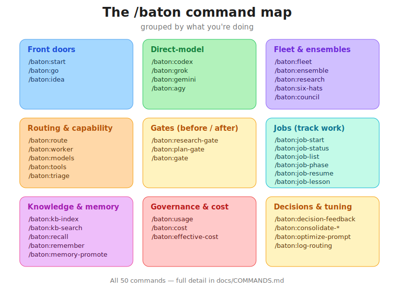
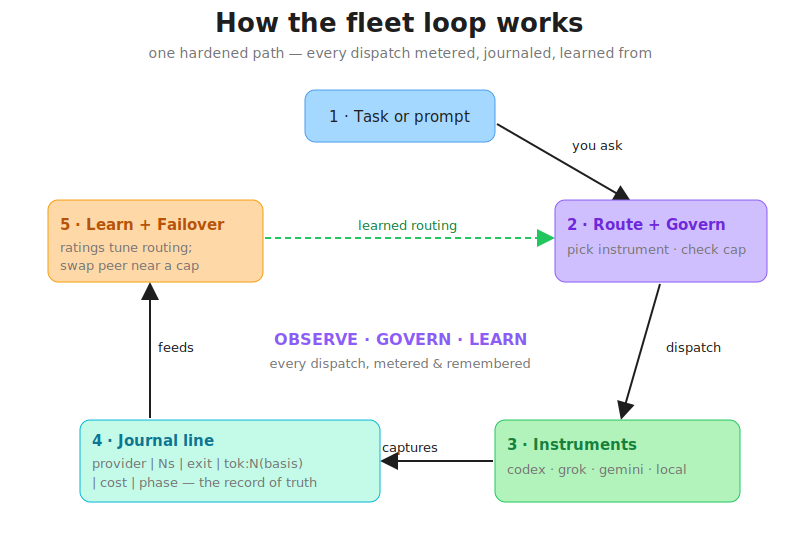

# Baton

**Conduct the fleet.**

Baton turns Claude Code into the conductor of a fleet of coding LLMs — paid cloud
CLIs, free CLIs, and local models on your own machines. You hand each task to the
right agent (pass the baton), and Baton tracks what they did, what it cost, what
you decided, and what you learned. Built on
[claude-octopus](https://github.com/nyldn/claude-octopus) as the dispatch layer
(recommended companion plugin, not a hard dependency).

**Status:** `v1.15.0` — *the fleet does the labor.* The conductor now farms coding tasks out to
non-Claude instruments and gets repo-applied results back — with direct `/baton:codex|grok|gemini|agy`
lines to every model, per-model token telemetry, plan/research/acceptance gates, and a usage governor
that keeps spend legible. **MIT licensed.** An early/experimental personal project, shared in the hope
it's useful — not a turnkey product.

### 📖 New here? Read these

- **[Full guide (start to finish)](docs/GUIDE.md)** — what it is, how to install, and a worked walkthrough.
- **[Command reference](docs/COMMANDS.md)** — every command and flag, in plain language.
- **[Decision log](docs/DECISIONS.md)** — every design decision and why.
- [Roadmap](docs/roadmap.md) — what's shipped and what's parked.

### Install (Claude Code plugin)

```
claude plugin marketplace add Ryfter/baton
claude plugin install baton@ryfter
```

Commands surface as `/baton:<command>` — e.g. `/baton:go "ship the feature"`, `/baton:codex "..."`,
`/baton:route`, `/baton:fleet doctor`, `/baton:usage`.

---

## Visual overview

**The mental model** — three tiers, like an orchestra. You + Claude Code conduct; the orchestrators
route, gate, and govern; the instruments (the fleet) do the labor. CLI-first — the dashboard is a
control board over the same commands.



**Using /baton — the happy path.** Which command drives each step, from a spark to shipped.



**The command map.** All 50 commands, grouped by what you're doing.



**The fleet loop.** Every dispatch is routed, metered, journaled, and learned from — observe, govern, learn.



> Diagram sources live in [`docs/assets/diagrams/`](docs/assets/diagrams/) (SVG — editable, versioned).

---

## Features

Each feature has a one-line "what it does"; the link goes to its full design spec.

- **Automatic usage tracking** — every AI dispatch is logged with time, cost, and token
  counts to a journal, plus a catalog of each model's strengths and pricing.
  Commands: `/baton:log-routing`, `/baton:consolidate-routing`.
- **Live web dashboard** — a browser view at `http://localhost:8765` showing real-time
  activity, today's spend, a model leaderboard, and controls to stop local models. Runs
  fully offline. ([spec](docs/superpowers/specs/2026-05-22-coding-agent-orchestrator-design.md))
- **A dispatchable fleet of AI models** — one registry of paid CLIs, free CLIs, and
  local models, all callable from a single command. Adding a model is a few lines of
  config. Commands: `/baton:fleet doctor|list|test`.
  ([spec](docs/superpowers/specs/2026-05-26-plan4-fleet-design.md))
- **Cross-machine fleet** — pull models running on *other* machines into the fleet over
  a private network (Tailscale), so a beefier desktop's local models are usable from your
  laptop.
- **Job tracking with phases** — track a unit of work from research → design → code →
  review, each job in its own folder with a brief, a phase log, and captured lessons.
  Commands: `/baton:job-start`, `/baton:job-status`, `/baton:job-list`, `/baton:job-phase`, `/baton:job-resume`, `/baton:job-lesson`.
  ([spec](docs/superpowers/specs/2026-05-26-plan3-job-scaffold-design.md))
- **A searchable knowledge base** — your lessons and decisions become a meaning-based
  (semantic) search index, fully local — no cloud, no cost. Commands: `/baton:kb-index`,
  `/baton:kb-search`. ([spec](docs/superpowers/specs/2026-05-30-plan8-kb-embeddings-design.md))
- **Multi-model research ensembles** — ask one question to several models at once and
  get a single synthesis of where they agree, differ, and what's uniquely useful.
  Commands: `/baton:ensemble`, `/baton:research`.
  ([spec](docs/superpowers/specs/2026-05-29-plan5-research-ensemble-design.md))
- **Six Thinking Hats** — examine a question from six fixed angles (facts, feelings,
  risks, benefits, creativity, process), then a synthesized conclusion. Command: `/baton:six-hats`.
  ([spec](docs/superpowers/specs/2026-05-30-plan5b-six-hats-design.md))
- **LLM Council** — a two-round deliberation where models answer, then refine after
  seeing each other's answers; Claude chairs the verdict. Command: `/baton:council`.
  ([spec](docs/superpowers/specs/2026-05-30-plan5c-council-design.md))
- **Parallel code implementation** — turn a finished spec into working code: slice it
  into independent tasks, build them concurrently in isolated repo copies, then merge
  with conflict detection. Commands: `/baton:code-decompose`, `/baton:code-parallel`, `/baton:code-merge`.
  ([spec](docs/superpowers/specs/2026-05-30-plan6-code-phase-design.md))
- **Multi-project portfolio** — one screen showing cost, active jobs, decisions, and
  last activity across *every* project you've worked on, with per-project drill-in.
  ([spec](docs/superpowers/specs/2026-05-30-plan7-command-center-design.md))
- **Live ensemble cockpit** — watch a multi-model run unfold in the dashboard: each
  model's status, duration, and partial answer appear the moment it finishes.
- **A self-improving decision log** — every significant choice is captured (decision,
  alternatives, reasoning); you attach outcomes, and proven patterns roll up into
  per-project and cross-project guidance. Commands: `/baton:decision-feedback`,
  `/baton:consolidate-decisions`, `/baton:project-init`. See the [Decision log](docs/DECISIONS.md).
  ([spec](docs/superpowers/specs/2026-05-29-decision-loop-design.md))
- **Per-project cost ledger** — a simple running spend record per project. Command: `/baton:cost`.

### The Fleet Conductor release (v1.2.0)

- **Capability-routing optimizer** — an explainable, cheapest-tier-first auto-router over your
  models + tools: it picks the *optimal* (not most-powerful) capability, dispatches, verifies,
  and escalates up the cost ladder on failure — then **learns** which model/tool wins each
  capability from your ratings + an LLM judge, and supports a fan-out **calibration** mode.
  Command: `/baton:route` (`--run`, `--rate`, `--calibrate`, `--rank`).
- **Cost-Optimization Engine (time-awareness)** — rank-gates paid/frontier dispatch during
  prime-peak hours (rank 1 = spend-worthy … 5 = wait for off-peak) and scales concurrency up
  during off-peak/weekend surge windows. Config: `$BATON_HOME/prime-hours.yaml` (default `~/.baton/prime-hours.yaml`).
- **`/baton:idea` front door** — turn a raw idea into board-ready GitHub issues with one human gate
  (KB prefetch → research ensemble → council viability debate → concept doc → issues).
- **Tools registry** — a non-LLM capability registry (`tools.yaml`), co-equal sibling of the
  model fleet; first entry is Docling for PDF extraction. Command: `/baton:tools list|doctor`.
- **Grimdex integration** — the knowledge base is now its own standalone, tool-agnostic project
  ([Ryfter/Grimdex](https://github.com/Ryfter/Grimdex)). This repo wires into it via a pointer
  stanza and works with or without it (graceful degradation).

### New since v1.2.0 — the conductor learns to delegate (v1.3 → v1.15)

The spine of every release since: make the conductor actually *farm out the labor* and stay
legible about cost while doing it. Full notes live in [`docs/releases/`](docs/releases/).

**Fleet does the labor**
- **Direct lines to every model** — `/baton:codex`, `/baton:grok`, `/baton:gemini` (+ `/baton:agy`)
  dispatch one prompt straight to that instrument through the hardened, journaled fleet path.
  `--tier <name>` selects a model/effort tier; `--tier all` boundary-tests every tier. *(v1.15.0)*
- **`/baton:go` — the natural-language front door** — describe an outcome; the Conductor plans it
  into a task DAG and runs it full-auto under two guards (budget cap + destructive-action gate),
  narrating as it goes and interrupting only for real decisions. *(v1.10 → v1.11)*
- **Agentic executor** — instruments edit files and return repo-applied results, not just chat
  text; chat-completion vs. agentic providers are handled by output contract. *(v1.11.0)*

**Legibility & cost control**
- **Per-model token telemetry** — every dispatch records tokens (exact when the CLI prints a count,
  honest estimate otherwise) alongside time and exit code in the journal. *(v1.15.0)*
- **Usage governor + Copilot credit budget** — track worker lockouts, reset ETAs, conserve mode, and
  a fail-open spend panel over the GitHub billing API. Commands: `/baton:usage`, `/baton:worker`. *(v1.12 → v1.14)*

**Quality gates**
- **Plan / research / acceptance gates** — competitive review before *and* after labor: a research
  build/adopt/adapt verdict, a plan accept/revise/reject verdict, and an artifact accept/polish/reject
  verdict with a polish brief. Commands: `/baton:research-gate`, `/baton:plan-gate`, `/baton:gate`. *(v1.12 → v1.13)*

**Self-improvement**
- **GEPA planner-prompt optimization** — the Conductor's planner prompt evolves through a candidate
  pool with live shadow A/B testing; winners promote on your `--apply`. Command: `/baton:optimize-prompt`. *(v1.6 → v1.7)*
- **Guided-use coach** — a rules engine that surfaces the right next command via a session digest and
  one-shot `Next:` footers (`off`/`quiet`/`teach`). *(v1.8.0)*
- **Triage & dev memory** — classify an issue into type/priority/estimate/risk/pipeline (`/baton:triage`);
  warn before you repeat a known-bad fix (`/baton:recall`, `/baton:remember`). *(v1.9+)*

---

## Quick start

```powershell
# 1. Install Baton (Claude Code plugin — the primary path)
claude plugin marketplace add Ryfter/baton
claude plugin install baton@ryfter

# 2. (recommended) Install the Octopus dispatch plugin
claude plugin marketplace add https://github.com/nyldn/plugins.git
claude plugin install octo@nyldn-plugins

# 3. (optional) enable cost tracking — add to your PowerShell profile:
#    . $HOME\.claude\otel-env.ps1

# 4. Start the dashboard
python -m uvicorn dashboard.main:app --port 8765   # then open http://localhost:8765

# 5. Confirm the fleet is healthy
#    (in Claude Code)  /baton:fleet doctor
```

Contributing or hacking on Baton itself? Clone and bootstrap instead:

```powershell
git clone https://github.com/Ryfter/baton.git
cd baton
pwsh -NoProfile -File scripts\bootstrap.ps1   # idempotent — safe to re-run
```

Full details and a worked example: **[docs/GUIDE.md](docs/GUIDE.md)**.

---

## Architecture

Baton is built in three tiers, like an orchestra:

1. **Conductor** — you + Claude Code, the thin interface. It reads intent, chooses who plays,
   and keeps the score. Claude Code *is* the orchestrator — no separate daemon.
2. **Orchestrators** — the brain: routing, gates, the decision loop, cost/usage governance.
   One planner with two modes (advise, or run full-auto via `/baton:go`).
3. **Instruments** — the fleet: paid cloud CLIs, free CLIs, and local models on your own
   machines, each dispatched through one hardened, journaled path.

**CLI-first, GUI as a control board.** Every capability is a `/baton:` command first; the web
dashboard is a *control board that listens to the same CLI surface* — it visualizes and drives
the commands, never a parallel code path. Anything the dashboard does, the CLI already did.

Mutable state lives under `$BATON_HOME` (default `~/.baton/` — `jobs/`, `runs/`, `fleet.yaml`,
`tools.yaml`, the journal); the knowledge base stays at `~/.claude/knowledge/`. See the
[design spec](docs/superpowers/specs/2026-05-22-coding-agent-orchestrator-design.md)
and the per-feature specs linked above.

## MCP server

Baton ships a FastMCP stdio server (`baton_mcp`) that exposes its core capabilities as
eight MCP tools. Every tool reads the same `BATON_HOME` state (default `~/.baton`) and
shells into the existing PowerShell libs via a thin adapter (`scripts/mcp-bridge.ps1`),
except `baton_kb_search` which calls the `kb` Python package in-process. No logic is
duplicated — the MCP surface is purely a cross-tool adapter over what already exists.

| Tool | Purpose |
|---|---|
| `baton_capabilities` | List every capability the router knows (tools.yaml + fleet general capabilities) |
| `baton_route` | Route a capability to the cheapest capable tool/model; with `prompt` dispatches + verifies |
| `baton_kb_search` | Semantic search over the knowledge base (decisions, lessons, specs) |
| `baton_job_status` | Show the active Baton job (id, phase, manifest) from BATON_HOME |
| `baton_job_list` | List Baton jobs — filter `active` (default), `done`, or `all` |
| `baton_fleet_list` | List registered fleet providers (name, kind, enabled, cost tier) |
| `baton_fleet_doctor` | Health-check every enabled fleet provider (PATH/HTTP reachability) |
| `baton_fleet_test` | Dispatch one prompt to one named fleet provider; return stdout/exit/duration |

### Registration

**Claude Code — automatic.** Installing the plugin (`claude plugin install baton@ryfter`)
auto-registers the server via `.mcp.json` at the plugin root. Tools surface as
`mcp__baton__<tool>` in every session. No extra steps needed. (The launch entry is a
small inline Python bootstrap that locates the plugin at runtime — `CLAUDE_PLUGIN_ROOT`
from the environment, falling back to the newest plugin-cache dir — because
`${CLAUDE_PLUGIN_ROOT}` is not substituted inside `.mcp.json` `env` values.)

**Codex CLI:**

```powershell
# Forward slashes are required — codex's arg parsing eats lone backslashes
# (stores D:DevBaton…, breaking the server). Windows accepts both forms.
codex mcp add baton `
  --env PYTHONPATH=D:/Dev/Baton `
  --env BATON_MCP_BRIDGE=D:/Dev/Baton/scripts/mcp-bridge.ps1 `
  -- python -m baton_mcp
```

Replace `D:/Dev/Baton` with your actual repo clone path. Verify with `codex mcp list`
(check the stored env paths survived intact) and a quick
`codex exec "Call the baton_capabilities MCP tool and report what it returns."`.

**Cursor** — add to `~/.cursor/mcp.json`:

```json
{
  "mcpServers": {
    "baton": {
      "command": "python",
      "args": ["-m", "baton_mcp"],
      "env": {
        "PYTHONPATH": "D:\\Dev\\Baton",
        "BATON_MCP_BRIDGE": "D:\\Dev\\Baton\\scripts\\mcp-bridge.ps1"
      }
    }
  }
}
```

Replace the paths with your actual repo clone path.

## Tests

```powershell
# PowerShell suites
pwsh -NoProfile -File scripts\test-hook.ps1
pwsh -NoProfile -File scripts\test-job-lib.ps1
pwsh -NoProfile -File scripts\test-fleet-lib.ps1
pwsh -NoProfile -File scripts\test-six-hats.ps1
pwsh -NoProfile -File scripts\test-council.ps1
pwsh -NoProfile -File scripts\test-code-lib.ps1
pwsh -NoProfile -File scripts\test-bootstrap.ps1
pwsh -NoProfile -File scripts\test-runs-lib.ps1
pwsh -NoProfile -File scripts\test-run-feed-hook.ps1
pwsh -NoProfile -File scripts\test-statusline-feed.ps1
# Python (dashboard + knowledge base + MCP server)
python -m pytest dashboard kb tools baton_mcp -q
```

## License

[MIT](LICENSE) © 2026 Kevin Rank.

This is a personal project built on [Claude Code](https://claude.com/claude-code) and
[claude-octopus](https://github.com/nyldn/claude-octopus). It assumes a Windows + PowerShell 7
+ Python 3.12+ environment with `gh` and (optionally) Ollama for local models. Provided as-is;
expect rough edges.
