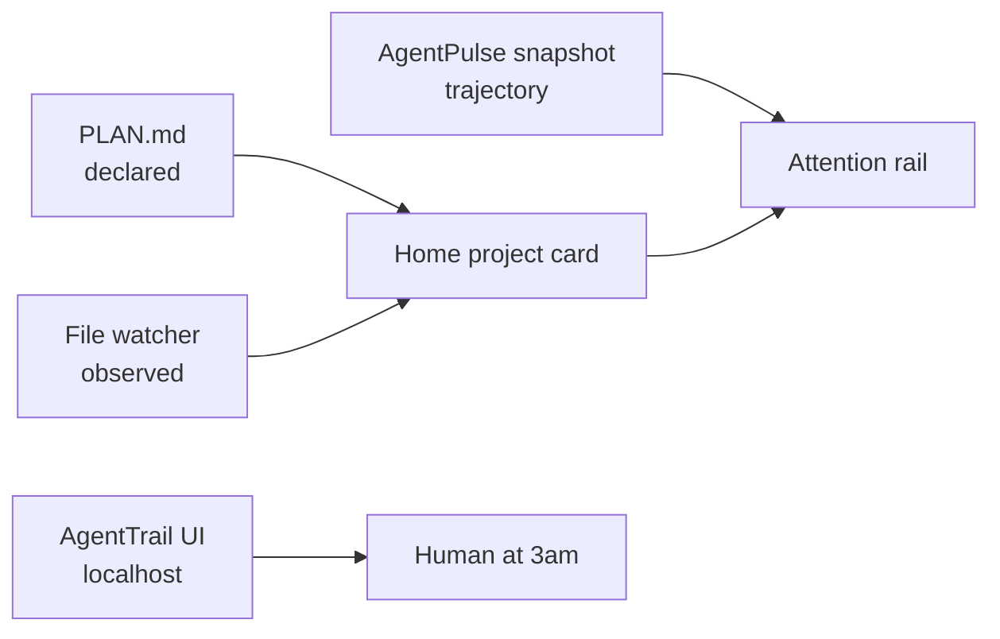

# Agent observability — declared vs observed

Baton’s Home shift board shows **admission, spend, and labor**. Per-repo agent
observability answers a different question: *is this agent making progress, or
quietly reopening work it already marked done?*

We **invoke, don’t absorb** two local tools:

| Tool | Role | Baton integration |
|---|---|---|
| [AgentTrail](https://github.com/sodiumsun/agenttrail) | Live repo map — `PLAN.md` vs file writes | Optional sidecar + card fields + map link |
| [AgentPulse](https://github.com/Conalh/AgentPulse) | Trajectory classifier — stuck / drifting / converging | Snapshot JSON → attention rail |

Not [camtrik/agent-trail](https://github.com/camtrik/agent-trail) (session replay).
Not [codedash](https://github.com/vakovalskii/codedash) (super-app browser).

## Mental model



- **Declared** — what the agent says it is doing (`[~]` tasks, blocked `[!]`).
- **Observed** — files touched in the last few minutes (from AgentTrail persisted
  state or live sidecar).
- **Regressed** — a component marked done but its `files:` globs were touched again.
- **Trajectory** — AgentPulse verdict when snapshot exists; else lightweight loop
  detection from Maestro `events.jsonl`.

Maestro jobs remain canonical for labor; `PLAN.md` is the agent-maintained sketch.

## Quick start

### AgentTrail sidecar (one repo)

```powershell
# From Baton repo — project must be in registry with folder set
pwsh -NoProfile -File scripts/fleet-agenttrail.ps1 -Action start -Project baton -Open -Json

# Status of all sidecars
pwsh -NoProfile -File scripts/fleet-agenttrail.ps1 -Action status -Json

# Stop
pwsh -NoProfile -File scripts/fleet-agenttrail.ps1 -Action stop -Project baton -Json
```

Or manually in the worktree:

```bash
cd ~/Dev/your-repo
npx agenttrail init   # once — scaffolds PLAN.md + hook convention
npx agenttrail --open   # live map on localhost:5330+
```

Sidecar metadata: `$BATON_HOME/observability/agenttrail/<project-id>.json`

### AgentPulse snapshot (fleet-wide)

```powershell
pwsh -NoProfile -File scripts/fleet-agenttrail.ps1 -Action snapshot -Json
```

Writes `$BATON_HOME/observability/agentpulse.json`. Refresh on a cron or before
opening Home during heavy factory runs.

### Dark factory worktrees

When seeding overnight lanes, start AgentTrail on the active worktree folder
(the path in `project.json` or the `.baton-worktrees/WT-*` checkout):

```powershell
pwsh -NoProfile -File scripts/fleet-agenttrail.ps1 -Action start -Project grimdex-edu -Folder D:\Dev\Grimdex-edu -Json
```

## Environment

| Variable | Default | Effect |
|---|---|---|
| `BATON_AGENTTRAIL` | `1` | Set `0` to skip localhost sidecar probes |
| `AGENTTRAIL_PORT` | auto | Passed through to `npx agenttrail` |

## Network reachability (baton-d139)

AgentTrail binds `127.0.0.1` by default. To view from another device on the LAN,
use a reverse proxy or SSH tunnel — do not bind `0.0.0.0` without intent.
Grimdex rule: `~/Dev/Grimdex/universal/claude-rules/network-reachable-dev-servers.md`.

## Dashboard surfaces

- **Attention rail** — stuck/drifting trajectory, regressed done components,
  blocked `[!]` tasks in `PLAN.md`.
- **Project card** — “Declared vs observed” block with trajectory line, active
  tasks, live file touch, “Open AgentTrail map →” when sidecar is up.

Reader: `dashboard/readers/agent_observability.py`

## PLAN.md convention

Agents maintain `PLAN.md` per [AgentTrail v2](https://github.com/sodiumsun/agenttrail).
Baton parses the same convention for card summaries — no duplicate schema.

Minimum useful shape:

```markdown
# my project

## Read alerts out loud {#notify}
files: [src/notify/**]
- [~] Wire the TTS path {#notify-tts}
  by: claude
- [x] Parse incoming webhook {#notify-parse}
  by: codex

## decisions
- 2026-08-24: use local sidecar, not cloud telemetry
```

## What we deliberately did not build

- Full AgentTrail UI inside Baton (link out instead).
- AgentPulse TUI embedded in the dashboard (snapshot + rail only).
- Transcript replay (codedash / camtrik territory).
- Auto-`init` on every project create — run `agenttrail init` when a repo earns a map.

## Related

- Home redesign spec: `docs/superpowers/specs/2026-08-23-maestro-home-redesign-design.md`
- Landscape row: `Grimlore/projects/baton/list-of-urls.md`
- Ecosystem boundaries: `docs/ecosystem-boundaries.md`
