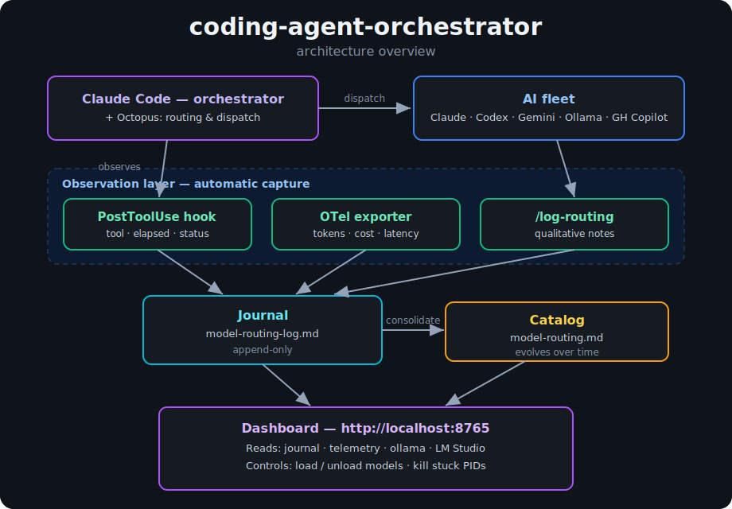

# Coding Agent Orchestrator — Design

**Date:** 2026-05-22 (revised same day after build-vs-buy decision)
**Status:** Draft, awaiting user review
**Author:** Kevin Rank (with Claude)

## Purpose

Use Claude Code as the command-and-control layer for a fleet of coding-capable LLMs running locally and in the cloud. Claude orchestrates; cheaper / specialized models do the grunt work. Goals in priority order:

1. **Cost / quota offloading.** Push routine work (boilerplate, edits, summaries, commit messages, simple refactors) to free local models or cheap-tier API models so Claude's quota goes to hard reasoning and orchestration.
2. **Capability routing.** Match task to model — huge-context summarization → Gemini, raw code → Codex / qwen3-coder, private data → local, structured extraction → nuextract, commit messages → tavernari/git-commit-message.
3. **Concurrency.** Run multiple delegated jobs simultaneously, exploiting Claude Code's native parallel-Agent dispatch.
4. **Observability.** Know which model did what, how long it took, and how much it cost. Build a running log of what each model is good and bad at.
5. **Live dashboard.** A browser-based dashboard showing current activity, cost, model status, and recent history — opened on demand, not always-on.
6. **Out of scope (for v1).** Ensemble / voting across models for the same task. Native desktop app (Tauri). Always-on tray app. Hosted dashboard. All can be revisited later.

## Non-goals

- Building MCP servers for any of the workers.
- Building our own subagent fleet — Octopus provides 32 specialized personas and a smart router (`/octo:auto`) that covers the general case.
- Replacing Octopus's router. We observe and annotate; we do not re-route.
- A web UI, a TUI, or anything beyond markdown + PowerShell + Claude Code's hook system.

## Architecture overview

<p align="center">
  
</p>

> The SVG above is the committed, self-contained render — it scales to fit, renders
> inline on GitHub, and depends on no external service. An editable hand-drawn version
> can be regenerated with the Excalidraw connector.

### Repository & runtime layout

The repo is the **source of truth**; `bootstrap.ps1` deploys copies into `~/.claude/`,
where your jobs, knowledge, and journal accumulate as you work.

```mermaid
flowchart LR
    subgraph REPO["repo: coding-agent-orchestrator/"]
        direction TB
        R1["commands/ — slash-command definitions"]
        R2["scripts/ — PowerShell libs, hooks/, fleet/"]
        R3["dashboard/ — FastAPI + htmx web UI"]
        R4["kb/ — Python embeddings + search"]
        R5["docs/ — GUIDE, COMMANDS, DECISIONS, specs"]
        R6["references/fleet.yaml — starter fleet registry"]
    end
    subgraph HOME["~/.claude/ — deployed runtime + your data"]
        direction TB
        H1["commands · hooks · scripts — deployed copies"]
        H2["fleet.yaml — your live model registry"]
        H3["model-routing-log.md — the journal"]
        H4["jobs/ — one folder per job"]
        H5["ensembles/ — ad-hoc multi-model runs"]
        subgraph KNOW["knowledge/ — private Ryfter/knowledge repo"]
            direction TB
            K1["universal/ — routing catalog + guidance"]
            K2["projects/ID/ — decisions, guidance, cost"]
            K3[".index/ — semantic search vectors"]
        end
    end
    REPO ==>|"bootstrap.ps1 deploys"| HOME
    classDef repo fill:#13233b,stroke:#3b82f6,color:#e2e8f0
    classDef home fill:#13233b,stroke:#10b981,color:#e2e8f0
    classDef know fill:#241a3a,stroke:#a855f7,color:#f3e8ff
    class R1,R2,R3,R4,R5,R6 repo
    class H1,H2,H3,H4,H5 home
    class K1,K2,K3 know
```



**Source of truth:** the repo at `D:\Dev\coding-agent-orchestrator`. A bootstrap script deploys hooks, OTel config, slash command, and catalog into `~/.claude/`.

## Components

### 1. Octopus (adopted, not built)

Already installed via `claude plugin marketplace add` + `claude plugin install octo@nyldn-plugins`. Provides:

- **`/octo:auto`** — smart routing for general coding/research tasks across 8 providers (Claude, Codex, Gemini, Copilot, Qwen, Ollama, Perplexity, OpenRouter).
- 32 specialized agent personas, 48 commands, 52 skills.
- Local logs at `~/.claude-octopus/logs/`, structured results at `~/.claude-octopus/results/`.
- `octopus agent-summary` for post-run provider participation reports.

We use Octopus as-is. We do not modify its router or commands. The only Octopus-specific touchpoint in our code is the `agent-summary` parser used by the catalog consolidation flow (see §5).

### 2. PostToolUse hook (automatic capture)

A hook configured in `~/.claude/settings.json` runs after every tool invocation. A small PowerShell script (`scripts/hooks/log-tool-call.ps1`, deployed to `~/.claude/hooks/`) receives the tool event, filters for dispatches (Agent invocations, Bash commands matching known model CLIs: `gemini`, `codex`, `ollama`, `lms`, `copilot`, `gh copilot`), and appends one line to `~/.claude/model-routing-log.md`:

```
2026-05-22T14:32:15-05:00 | hook | bash:ollama run devstral:24b | 38s | exit:0 | "refactor session.ts"
2026-05-22T14:32:53-05:00 | hook | agent:octopus-coder | 51s | exit:0 | "implement TokenStore"
```

Format: `ISO-timestamp | source | dispatch-target | elapsed | exit-status | brief`.

**Why hooks over Octopus internals:** universal, plugin-agnostic, future-proof. Works for any tool we add later, not just Octopus.

**Calibration step:** the hook's "known model CLI" pattern list is built empirically by running `/octo:auto` once on a real task, inspecting `~/.claude-octopus/logs/` to learn what tools Octopus actually invokes, then encoding those patterns. The bootstrap script generates a starter pattern list; we tune it after first use.

### 3. OpenTelemetry exporter (cost & token capture)

Claude Code natively emits OTel events when `OTEL_LOGS_EXPORTER` is set (per Claude Code monitoring docs). We configure a local file exporter writing to `~/.claude/telemetry/events.jsonl`. A small periodic parser (`scripts/parse-otel.ps1`) reads new events, extracts per-call token counts and dollar costs, and folds them into the journal as a second line type:

```
2026-05-22T14:32:15-05:00 | otel | claude-sonnet-4.6 | in:3214 out:892 | $0.0142 | tool_use
```

Run mode for the parser:
- **On-demand:** invoke during the consolidation flow.
- *(Future)* scheduled task if the on-demand model proves too lossy.

Cost / token data is what hooks can't see. The two streams are intentionally separate line types in the same journal — `hook` vs `otel` — so consolidation can correlate or treat them independently.

Exact env var names and exporter modes are deferred to the implementation plan (verified against current Claude Code docs at plan-writing time), not hardcoded into this spec.

### 4. `/log-routing` slash command (qualitative capture)

A custom command at `~/.claude/commands/log-routing.md`. User or Claude invokes it after a notable dispatch with a one-line judgment:

```
/log-routing devstral:24b nailed the refactor style, matched our existing patterns
/log-routing gemini bailed on the multi-file rename, got the first file then quit
```

Appends to the journal as a third line type:

```
2026-05-22T14:35:22-05:00 | note | devstral:24b | "nailed refactor style, matched patterns"
```

Captures the qualitative signal that hooks and OTel can't see ("output was technically correct but ugly"). Low-friction, semantic, intentionally human-curated.

### 5. Catalog, journal, consolidation

Unchanged from v1 in concept; updated in detail to reflect the new data sources.

- **`~/.claude/model-routing.md`** — catalog. One section per model: backend, context window, strengths, weaknesses, cost tier, warm-up notes. Two consumers:
  - **Claude (orchestrator)** consults it when Octopus's auto-routing isn't enough — e.g. "use the specialty commit-message model" or "prefer local for this private-data task."
  - **The consolidation flow** treats it as the destination for promoted observations.

- **`~/.claude/model-routing-log.md`** — append-only journal. Three line types (`hook`, `otel`, `note`) all sharing the same `timestamp | source | …` prefix for greppability.

- **Consolidation flow** — a `/consolidate-routing` slash command (deployed alongside `/log-routing`). When invoked, Claude:
  1. Reads the journal since last consolidation.
  2. Runs `octopus agent-summary` to get Octopus's own provider participation view.
  3. Detects patterns (model X failed N times on task type Y, model Z averages $0.04 per success).
  4. Proposes catalog updates for user approval.
  5. On approval, edits `model-routing.md` and archives consolidated log entries into `~/.claude/model-routing-log-archive-YYYY-MM.md`.

Manual trigger only. Not scheduled.

### 6. Dashboard (`scripts/dashboard.ps1` → local web app)

Browser-based dashboard, launched on demand. Single-page app at `http://localhost:8765`.

**Stack:** Python 3 + FastAPI backend (one file, ~150–200 lines) + a single HTML page using htmx for live updates and Chart.js for sparklines. Tailwind via CDN for styling. No build step. The Python venv is created by the bootstrap script.

**Panels:**
- **Live activity** — currently-running providers (mirrors Octopus colored-dot indicators but persistent and bigger), with elapsed time and originating prompt summary. Currently-warm Ollama/LM Studio models with VRAM usage.
- **Today's spend** — cumulative cost from OTel events, broken down by provider. 7-day sparkline trend.
- **Recent journal** — last ~30 entries from `model-routing-log.md`, color-coded by line type (`hook` / `otel` / `note`), filterable by provider. Clickable to expand to full result in `~/.claude-octopus/results/<runid>/`.
- **Per-model leaderboard** — success rate, average cost, average latency over last 30 days, computed from journal + OTel.
- **Controls panel:**
  - **Load / unload LM Studio model** — `lms load <model>` / `lms unload <model>`.
  - **Stop Ollama model** — `ollama stop <model>` to evict from VRAM.
  - **Kill stuck PID** — only PIDs that the hook system has recorded in the journal. The dashboard never shows arbitrary processes — only ones the orchestrator started. Safer.
  - All control actions append a `note` line to the journal: `dashboard | <action> | <target>`.

**Update mode:** HTMX polling every 2 s by default. Switches to Server-Sent Events when journal write-rate exceeds 5 events/s (rare).

**Data sources (all already produced by other components):**
- `~/.claude/model-routing-log.md`
- `~/.claude/telemetry/events.jsonl`
- `~/.claude-octopus/results/` and `octopus agent-summary`
- `ollama ps` (subprocess) and `lms ls` (subprocess) and LM Studio `http://localhost:1234/v1/models`

**Launch:** `scripts/dashboard.ps1` starts the FastAPI server and opens the browser tab via `Start-Process`. Closing the terminal stops the server. Bootstrap offers to launch the dashboard at the end of install.

**Out of scope for v1:** authentication (binds to localhost only), historical analytics beyond 30 days (use OTel JSONL directly for that), mobile layout, dark mode (Tailwind defaults).

### 7. Bootstrap script (`scripts/bootstrap.ps1`)

Narrower scope than v1. Steps:

1. **Verify Octopus is installed.** If not, print instructions and exit — Octopus install is a one-liner the user runs themselves.
2. **Pull recommended specialty Ollama models** (skip if present):
   - `qwen2.5-coder:7b-instruct-q5_K_M` — small fast coder
   - `deepseek-coder-v2:16b-lite-instruct-q5_K_M` — code review specialist
   - `hermes3:8b` — function-calling tuned (future use)
   - `nuextract` — structured JSON extraction
   - (Already pulled: `tavernari/git-commit-message`, `devstral:24b`, `qwen3:30b`, `phi4:14b`, `deepseek-ocr`, vision, embeds.)
3. **Install GitHub Copilot CLI** by running `gh copilot` once if not already installed (it self-downloads).
4. **Deploy hooks:** copy `scripts/hooks/log-tool-call.ps1` → `~/.claude/hooks/`, merge `PostToolUse` entry into `~/.claude/settings.json` (preserve existing entries).
5. **Deploy OTel config:** set the relevant env vars in a profile-loaded file (`~/.claude/env.ps1` or similar — exact mechanism decided in implementation plan), create `~/.claude/telemetry/` directory.
6. **Deploy slash commands:** copy `commands/log-routing.md` and `commands/consolidate-routing.md` → `~/.claude/commands/`.
7. **Deploy catalog:** copy `references/model-routing.md` → `~/.claude/model-routing.md` if not present; prompt before overwriting. Create empty `~/.claude/model-routing-log.md` if missing.
8. **Verify backends reachable:** `gemini`, `codex`, `ollama list`, LM Studio `:1234`, `gh auth status`, `copilot --version`.
9. **Set up dashboard:** create a Python venv under `dashboard/.venv`, `pip install fastapi uvicorn jinja2`. Verify import.
10. **Print summary report:** what was installed, what was skipped, what needs manual attention. Offer to launch the dashboard (`scripts/dashboard.ps1`).

Idempotent — safe to re-run.

## Data flow — example end-to-end

User: *"Refactor `src/auth/session.ts` to use the new TokenStore."*

1. Claude decides to delegate via Octopus: invokes `/octo:auto` with the task.
2. Octopus routes — say it picks Codex for code generation plus Ollama (devstral:24b) for review.
3. Both providers run. Octopus writes results to `~/.claude-octopus/results/<runid>/` and updates its agent ledger.
4. **PostToolUse hook fires** for each underlying tool call, appending `hook` lines to the journal.
5. **OTel exporter** writes JSONL events to `~/.claude/telemetry/events.jsonl` in the background.
6. Claude reports the refactor result to the user.
7. User (or Claude, if the run was notable) runs `/log-routing devstral review caught a null-check bug Codex missed`.
8. Next week, user runs `/consolidate-routing` → parser reads journal + OTel + Octopus ledger → proposes catalog update: "devstral:24b: promote to 'review specialist' (caught 3/5 review tasks Codex missed last month, avg $0 vs Codex $0.18)."

For parallel work — *"summarize these three docs"* — Claude invokes Octopus three times in a single message; the hook captures each, OTel records token cost per call.

## Error handling

- **Hook script crashes:** Claude Code's hook system isolates the failure — the underlying tool call still completes, only the log line is lost. Hook script logs its own errors to `~/.claude/hooks/log-tool-call.err.log`.
- **OTel exporter unconfigured / endpoint down:** Claude Code silently no-ops. The journal still gets `hook` and `note` lines, just no `otel` lines for that period. Bootstrap re-verification catches misconfig.
- **Octopus run fails:** Octopus surfaces the failure itself. Hook still captures the attempt with `exit:non-zero`. No silent retries on a different orchestration tool.
- **Specialty model unreachable:** when Claude invokes Ollama specialty models directly (e.g. `tavernari/git-commit-message`), Bash returns non-zero, hook records it, Claude either falls back to writing the commit message itself or reports up to the user. Never silent.

## Testing strategy

- **Bootstrap smoke test:** `scripts/test-bootstrap.ps1` verifies each backend is reachable post-install.
- **Hook contract test:** `scripts/test-hook.ps1` simulates a tool-call event with canned input, checks the resulting log line matches the expected format.
- **OTel parser test:** `scripts/test-otel-parser.ps1` runs the parser against a sample JSONL fixture and verifies journal output.
- **End-to-end smoke:** after bootstrap, run a real `/octo:auto` task ("rename function X to Y") and confirm: (a) hook line appears in journal, (b) OTel events land in `~/.claude/telemetry/`, (c) `octopus agent-summary` runs cleanly. Eyeball, not automated.

## File layout (repo)

```
D:\Dev\coding-agent-orchestrator\
├── README.md                            # what this is, how to install
├── docs\
│   └── superpowers\
│       └── specs\
│           └── 2026-05-22-coding-agent-orchestrator-design.md   ← this file
├── commands\
│   ├── log-routing.md                   # /log-routing slash command
│   └── consolidate-routing.md           # /consolidate-routing slash command
├── references\
│   ├── model-routing.md                 # catalog (pre-populated)
│   └── model-routing-log.md             # empty log seed (header only)
├── dashboard\
│   ├── app.py                           # FastAPI app (single file)
│   ├── templates\
│   │   └── index.html                   # htmx + Chart.js + Tailwind via CDN
│   ├── static\                          # any icons / small assets
│   ├── requirements.txt                 # fastapi, uvicorn, jinja2
│   └── .venv\                           # created by bootstrap (gitignored)
└── scripts\
    ├── bootstrap.ps1
    ├── dashboard.ps1                    # launches FastAPI + opens browser
    ├── hooks\
    │   └── log-tool-call.ps1            # PostToolUse hook target
    ├── parse-otel.ps1                   # OTel JSONL → journal
    ├── test-bootstrap.ps1
    ├── test-hook.ps1
    ├── test-otel-parser.ps1
    └── test-dashboard.ps1
```

After `bootstrap.ps1` runs, the deployed layout under `~/.claude/`:

```
~/.claude/
├── settings.json                  (merged with PostToolUse entry)
├── hooks/
│   └── log-tool-call.ps1          (copied from repo)
├── commands/
│   ├── log-routing.md             (copied from repo)
│   └── consolidate-routing.md     (copied from repo)
├── telemetry/
│   └── events.jsonl               (created by OTel exporter)
├── model-routing.md               (copied from repo, editable in place)
└── model-routing-log.md           (created if missing; never overwritten)
```

## Success criteria

- After install, the journal grows automatically as you work — no extra action required per dispatch.
- A typical week's journal is informative enough that `/consolidate-routing` produces at least one useful catalog update.
- Token / cost data from OTel matches Anthropic's own usage dashboard within ±5 % (sanity check, not audit).
- Adding a new specialty model means: pull it, add a row to `model-routing.md`, add the CLI pattern to the hook script. No code changes elsewhere.
- The orchestrator survives an Octopus upgrade without breakage — because we don't depend on Octopus internals, only on Claude Code's hook + OTel APIs.
- Dashboard reflects new journal entries within 3 s of write (default 2 s poll + slack).
- Dashboard control actions (load/unload, stop, kill) execute within 5 s and the outcome is visible in the next refresh.
- Dashboard never lists processes the orchestrator didn't start — kill controls are safe by construction.

## Decisions made / open

- **Adopt vs build:** Octopus adopted as the dispatch layer. Subagent fleet from v1 dropped. Decided.
- **Routing style:** Auto (Octopus's `/octo:auto`). Decided.
- **Observation:** hooks + OTel + manual notes, all feeding one journal. Decided.
- **Source of truth:** repo at `D:\Dev\coding-agent-orchestrator`, deployed via `bootstrap.ps1`. Decided.
- **Consolidation:** manual `/consolidate-routing` command, not scheduled. Decided.
- **OTel env var specifics + exporter mode:** deferred to implementation plan (verify against current Claude Code docs).
- **Hook tool-pattern list:** seeded by bootstrap, tuned after first real Octopus run.
- **Bootstrap auto-pulls ~25 GB of new models:** acceptable (user confirmation pending in review).
- **Dashboard surface:** browser-on-demand (not tray, not native). Decided.
- **Dashboard interactivity:** read + controls together in v1 (load/unload, stop, kill). Decided.
- **Dashboard stack:** Python 3 + FastAPI + htmx + Chart.js + Tailwind via CDN. Decided.

## Decision history

- **v1 (earlier today):** designed our own subagent fleet (`gemini-worker`, `codex-worker`, `local-coder`, `local-fast`, `commit-bot`, `gh-ops`) wrapping CLI calls. ~7 markdown files + bootstrap.
- **Build-vs-buy pivot:** user surfaced existence of OpenClaw, Ruflo (Claude Flow), and Octopus. Investigation showed Octopus matches ~80 % of v1's scope out-of-the-box, with active maintenance and a richer provider list. Building our own subagent fleet became reinvention.
- **v2 (earlier this session):** adopt Octopus; redirect our build effort to the observation layer Octopus lacks — hooks for automatic capture, OTel for cost/token data, `/log-routing` for qualitative notes, plus the catalog/journal/consolidation we already designed. Net effect: ~half the code to write, more functionality (cost tracking), no router maintenance.
- **v3 (this revision):** user surfaced [dot-agent-deck](https://github.com/vfarcic/dot-agent-deck) — a Rust TUI dashboard for monitoring concurrent agent sessions, with its own hook installer. Same architectural bones as v2, but TUI-only. User wants a real (web) dashboard instead. Added §6 Dashboard: a local FastAPI + htmx app on `http://localhost:8765` that reads our existing journal + telemetry data sources and offers read + control (load/unload LM Studio models, stop Ollama models, kill orchestrator-spawned PIDs). Browser-on-demand, not tray. Net effect: roughly doubles the build, but the data plumbing was already done in v2.
