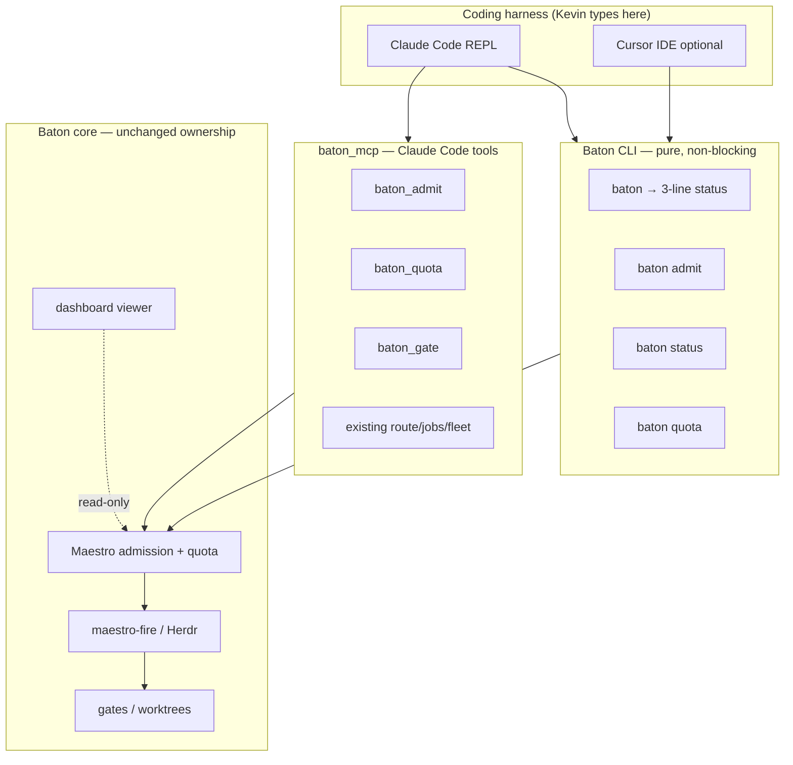

# Maestro CLI harness pivot — pure CLI + Claude Code REPL

**Date:** 2026-08-28  
**Status:** approved — S0 authorized via companion plan  
**Audience:** any agent implementing the Baton CLI front door  
**Operator decision:** **B** — bare `baton` stays a **pure CLI tool suite** invoked from Claude Code or a normal terminal; it does **not** launch Claude Code and does **not** own a chat loop.  
**Design review:** Antigravity (`scratch/antigravity-maestro-cli-design-pass-out.txt`, 2026-08-25)  
**Supersedes (CLI front door only):**
- `2026-08-15-maestro-front-door-design.md` — “sit at a local front door instead of Claude Code” is reversed for the **interactive REPL**; Maestro scheduling/admission stays.
- Room-as-home behavior shipped on `master` (Aug 2026) — demoted by this spec.
**Does not supersede:**
- `2026-08-23-maestro-home-redesign-design.md` — dashboard shift board at `:8765` remains the passive multi-project cockpit.
- `2026-08-22-maestro-harness-evaluation.md` — conductor + Herdr + headless labor; still canonical for factory runtime.

---

## Problem

Bare `baton` opens an interactive PowerShell “room”: ASCII box card, arrow-key project scroll, seat chrome, keyword menu. That shape is an **ops launcher**, not a coding harness. Kevin already lives in Claude Code and Cursor. He wants to sit in a normal coding REPL (Claude Code primary) and reach factory plumbing through **verbs and MCP tools**, not a custom terminal UI.

Prior specs correctly separated Maestro (silent quota/admission) from Conductor (talks). The mistake was building a third interactive layer — the room — instead of plugging Baton into an existing harness.

## Goal

When Kevin sits down to code:

1. He opens **Claude Code** (or Cursor) in a project worktree and types immediately.
2. Factory actions are **`baton <verb>`** from any terminal, or **MCP tools / slash skills** inside Claude Code.
3. Bare **`baton`** prints a **3-line passive status** from `cwd` and exits — never blocks in a menu loop.

**7-day factory uptime** and subscription utilization remain the north star. This spec fixes the **human-facing CLI shape** without moving quota math, gates, or parallel fire out of Baton.

## Non-goals

- Building or maintaining a custom TUI (Textual, Ink, ANSI scroll menus, home-rolled chat transcripts).
- Adopting DeepSeek Harness (Cordis) as the primary front door while it remains developer-preview.
- Replacing the web dashboard (`:8765`) — browser stays the shift board; CLI stays non-interactive by default.
- Embedding quota/worktree/Grimdex logic into client-side harness plugins.
- Bare `baton` auto-launching Claude Code, Codex, or any REPL (**decision B**).
- Durability levels 3–4 or multi-host Maestro (unchanged).

---

## Decisions

| Choice | Locked | Rejected |
|---|---|---|
| Interactive REPL | **Claude Code** (primary) | Custom PowerShell room; DeepSeek Harness as home |
| Bare `baton` | **3-line status + exit 0** | Room loop; verb list as default |
| Factory invoke | **`baton admit` / `status` / `quota`** + MCP | Plain-English room admission |
| DeepSeek Harness | **Steal patterns only** (event log discipline, runtime/UI split) | Cordis plugin maintenance |
| Pi-style REPL | **S2 optional `baton chat`** emergency fallback | S0 scope |
| Room code | **Remove from default paths in S0**; delete scroll/card in S0 or S1 | Keep room as hidden default |
| Dashboard | **Keep** at `:8765` | Merge dashboard into CLI |

---

## Architecture



**Boundary rule:** harnesses talk; Baton decides. Quota arithmetic, parallel slot claims, worktree isolation, and acceptance gates stay in PowerShell libs under `scripts/`. MCP and CLI are thin adapters (`baton_mcp`, `mcp-bridge.ps1`, verb dispatch).

---

## Bare `baton` — passive status (S0)

**Trigger:** `baton` with no arguments (same entry as today via `scripts/baton.ps1` → `maestro.ps1`).

**Behavior:** Print exactly **three lines** to stdout, exit **0**. No stdin read. No ANSI box. No seat label. Works when stdin is redirected or CI sets `BATON_NO_UI=1`.

**Line 1 — project context (from `cwd`):**

```
project  baton · /Users/kev/Dev/Baton
```

- Resolve registry id via `registry-lib.ps1` (`Get-ProjectId` on `(Get-Location).Path`), then match against `BATON_HOME/projects/*/project.json` and Maestro worktree choices (`Get-MaestroRoomChoices`).
- If cwd is inside a registered worktree, show **project id** (not worktree folder name) plus shortened absolute path.
- If no match: `project  (unregistered) · <cwd>`.

**Line 2 — quota headroom (compact):**

```
quota    Claude 5h  23% used · resets 2:15 pm · Cursor cycle 41%
```

- Reuse `cursor-quota-lib.ps1` caches (`Read-ClaudeQuotaCache`, `Update-CursorQuotaCache` without force refresh on bare status).
- Omit Cursor segment when cache unavailable (do not block on sqlite fetch).
- Use **detail** compact form, not the multi-line panel.

**Line 3 — factory activity:**

```
jobs     2 active · 1 held · 0 waiting quota
```

- Count Maestro jobs (`Get-MaestroJobRecords` under `maestro/jobs/`) in non-terminal statuses for **all projects** (not cwd-scoped — Kevin cares about factory pressure globally from any directory).
- Terminal statuses: `done`, `rejected`, `cancelled` (match existing Maestro job schema).
- `active` = `running` + `admitted`; `held` = `held`; `waiting quota` = `waiting-quota` if present in schema, else omit bucket.

**Footer (stderr, one line, dim optional):**

```
hint     baton admit "…" · baton status · baton quota · baton --help
```

stderr keeps stdout machine-parseable for scripts that might wrap line 1–3 later.

---

## Verb surface (S0)

| Verb | Runner | Purpose |
|---|---|---|
| *(none)* | `maestro.ps1` passive | 3-line status |
| `admit` | `maestro.ps1` | Queue Maestro job; project from `--project` or cwd inference |
| `status` | `maestro.ps1` | Full job table (existing `Invoke-MaestroStatus`) |
| `quota` | `cursor-quota.ps1` | Already shipped |
| `--help` | `baton.ps1` | Verb list — **not** the default no-arg behavior |

### `baton admit`

```
baton admit "refactor test harness"
baton admit --project canvas-toolchain "simplify install"
baton admit --fire "ship the front door"
baton admit --json --max-tier free "…"
```

- **Project default:** cwd inference (same resolver as passive status line 1). Error exit **2** with clear message if unregistered and `--project` omitted.
- **Implementation:** `New-MaestroJob` + optional `maestro-fire.ps1` when `--fire` (same semantics as `maestro go --fire`).
- **Does not** start Claude Code or open a REPL.

### Help copy (`Show-BatonHelp`)

Replace “type baton to start / you are in Maestro” with:

```
baton                  passive status (project, quota, jobs)
baton admit "goal"     queue dark-factory work
baton status           list Maestro jobs
baton quota            Claude 5h + Cursor meters
```

---

## What dies (S0)

- **`Invoke-BatonRoom`** as default for bare `baton`, `maestro` with no subcommand, and `maestro start`.
- **ASCII box card** (`Format-MaestroRoomBanner`, scroll items, `Read-BatonRoomLine`) — remove from executable paths; delete dead code in S0 or mark deprecated and delete in S1 if tests still cover lib helpers.
- **Project picker as home screen** — no arrow-key scroll, no “type a number to pick”.
- **Seat/PIN chrome** on the CLI front door (`💺 ox-alpha` in interactive prompts).
- **Plain-English room admission** — replaced by `baton admit "…"` or Claude MCP `baton_admit`.

**Keep but relocate:** utterance parser (`Resolve-MaestroUtterance`) may remain for MCP/conductor; not exposed on bare `baton`.

---

## What stays in Baton (do not move to harness)

- Rolling 5-hour / billing-cycle quota math and lockout (`window-budget-lib.ps1`, `cursor-quota-lib.ps1`).
- Maestro job admission, parallel fire, Herdr panes (`maestro-fire.ps1`).
- Gates, worktrees, `baton go --execute`, backlog driver.
- Dashboard at `:8765` as passive shift board.
- Fleet registry, routing, grimdex/decision capture rules.

---

## Slice plan

### S0 — Demote room, passive CLI (this plan)

- Bare `baton` → 3-line status.
- Add `admit` and `status` verbs to `verbs.yaml`.
- Remove room from default paths; update `test-maestro-cli.ps1`, `test-baton-cli.ps1`.
- Update help strings and `verbs.yaml` header comment.

**Success (S0):** `echo test | baton` exits immediately with 3 lines; no hang waiting for input. `baton admit "…"` from a registered project cwd creates `mj-*` job file.

### S1 — Claude Code first-class (days 2–3)

- Extend `baton_mcp` + `mcp-bridge.ps1`:
  - `baton_admit(project, goal, max_tier?, fire?)`
  - `baton_quota()` — structured quota headroom
  - `baton_gate(worktree?, suite?)` — wrap acceptance gate runner
- Document `claude mcp add baton …` in plugin README (repo path, not cache).
- Add slash command docs under `commands/` (`admit.md`, `status.md` or extend existing).

**Success (S1):** From Claude Code, one tool call admits background work without leaving the REPL.

### S2 — Statusline pressure + thin fallback (days 4–5)

- Ensure Claude statusline shows 5h + Cursor pressure (extend existing `~/.claude/statusline.sh` wiring if gaps remain).
- Optional **`baton chat`** — minimal streaming loop against fleet `ask` / local LM Studio when Claude subscription is empty. Pi-style: cwd context, type immediately, no project menu. **Not** Cordis.

**Success (S2):** Kevin sees quota pressure in the prompt bar; can talk to a local model via `baton chat` when Claude is capped.

---

## MCP tool sketch (S1)

| Tool | Args | Returns |
|---|---|---|
| `baton_admit` | `goal`, `project?`, `max_tier?`, `fire?` | `{ok, job_id, project, status}` |
| `baton_quota` | — | `{ok, claude_5h, cursor_cycle}` |
| `baton_gate` | `repo_path?`, `suite?` | `{ok, verdict, …}` |

Existing tools (`baton_route`, `baton_job_list`, `baton_fleet_*`, `baton_kb_search`) unchanged.

---

## Steal list (patterns, not forks)

| Source | Steal | Do not adopt |
|---|---|---|
| Claude Code | Slash commands, MCP-first tools, statusline | Closed agent loop fork |
| DeepSeek Harness | Append-only session event log; runtime/UI adapter split | Cordis plugin stack |
| Pi-like CLIs | Zero-ceremony cwd → type | Custom room menus |

---

## Testing

| Suite | S0 expectation |
|---|---|
| `scripts/test-maestro-cli.ps1` | Passive status assertions; admit from cwd; room tests removed or rewritten |
| `scripts/test-baton-cli.ps1` | Bare baton not room; help mentions admit |
| `scripts/test-cursor-quota.ps1` | Unchanged |
| `scripts/test-mcp-bridge.ps1` | Unchanged in S0; extended in S1 |

Hermetic tests use temp `BATON_HOME` — never touch real `~/.baton`.

---

## Risks

| Risk | Mitigation |
|---|---|
| Muscle memory: `baton` then type English | Help stderr hint; Claude skills document `/baton:admit` |
| Scripts piping bare `baton` expecting room | Redirected stdin already broke room UX; passive status is strictly better |
| Cwd not in registry | Clear error on `admit`; passive status shows `(unregistered)` |
| Claude Code lock-in | Factory core is headless; S2 `baton chat` + existing Codex/Grok labor unchanged |

---

## One-week success criteria (full pivot S0–S2)

1. Kevin opens Claude Code in a worktree and codes immediately — no Baton menu.
2. Background work queues via `baton admit` or MCP without blocking the REPL.
3. Zero time in ASCII scroll menus or PowerShell key-read loops.
4. Dashboard still answers “what is the factory doing overnight?” at `:8765`.

---

## Explicit conflicts resolved

| Prior doc | Conflict | Resolution |
|---|---|---|
| 2026-08-15 front door | “Local front door instead of Claude Code” | Claude Code **is** the interactive front door; Baton CLI is plumbing |
| 2026-08-22 harness eval | DeepSeek dismissed as overkill | Still dismissed **as primary**; patterns only |
| 2026-08-02 dev-root | Context-sensitive bare `baton` → UI at projects root | **Superseded** — bare `baton` is always passive status |
